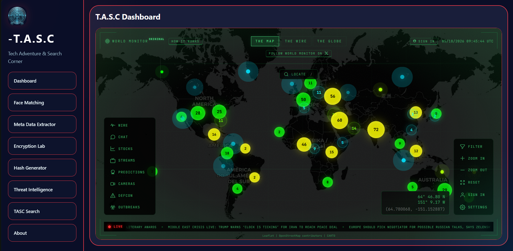

# T.A.S.C [Tech Adventure & Search Corner]

A browser-based security and search utility dashboard built with vanilla HTML, CSS, and JavaScript.

## Overview

T.A.S.C is a multi-tool web app that includes:
- Face matching engine with optional local comparison and Face++ API support
- Metadata extractor with image face detection
- Encryption and decryption utilities (Base64, XOR, combined file + text payloads)
- Hash generator and file hash scanner
- Threat intelligence quick links
- Google dorking search builder
- A separate `TASC Search` page for theme-safe search and quick query tools
## Figure

## Features

### Face Matching
- Upload two images
- Compare locally using image hashing and structural similarity
- Optional Face++ integration via API key/secret

### Metadata Extractor
- Upload files to view basic metadata
- Image preview with face detection where browser support exists

### Encryption Lab
- Encode/decode text using Base64
- Encrypt and decrypt files packaged with text payloads
- Simple XOR cipher mode with user-provided key

### Hash Generator
- Generate SHA-1, SHA-256, SHA-384, and SHA-512 hashes for text
- Compute SHA-256 digest for uploaded files

### Threat Intelligence
- Quick access links to popular OSINT and security tools
- Embedded optional browser frames for supported sites

### Search Tools
- Google dork builder for advanced search queries
- Search query preview, copy, and execute features
- Separate `TASC_search` page for enhanced search experience

## Usage Notes

- Face++ comparison may be blocked by browser CORS restrictions. If direct requests fail, use a server-side proxy or test locally with a local server.
- The app works entirely on the client side and does not require a backend.
- For best results, use modern browsers with support for the Web Crypto API and `FaceDetector`.

## Getting Started
Open link :  https://tasc24.great-site.net
